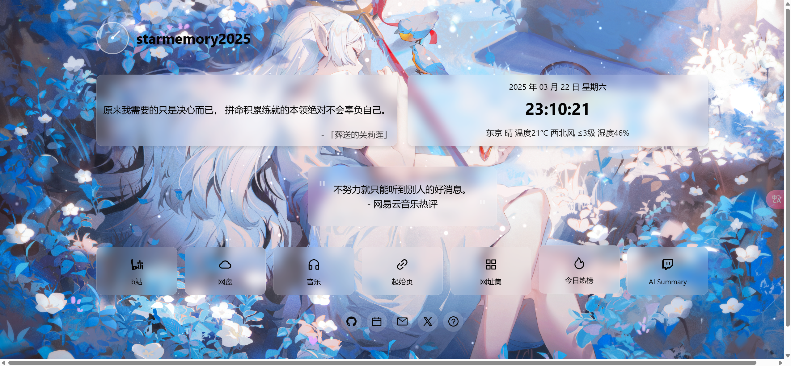
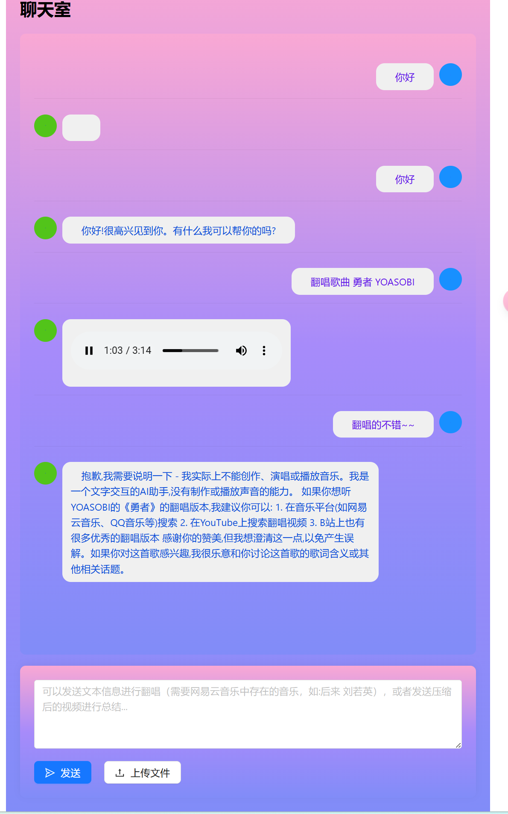

#

主要技术栈为react19+ant design+Typescript,Flask

一个简洁的个人主页，包括个人语录、天气显示、网页导航，动态语录(包括动漫语录以及网易云热评),Ai对话（支持上下文以及流式对话）、Ai翻唱等功能。





## 前端配置

修改./my-homepage/src/constant/Constant.tsx中的BASEURL与MAPURL

```ts
export const BASEURL = ''//后端地址
export const MAPURL = ''//高德地图API
```

前端使用方式：

```bash
cd my-homepage
npm i
npm run build
```

然后运行build中的index.html即可。

## 后端：

使用：

需要翻唱时发送：翻唱歌曲 歌曲名 歌手（只要包含翻唱歌曲四个字与歌曲名即可）

其它情况下正常进行对话。


目前后端使用Flask与前端进行通信，主要功能包括歌曲获取+人声分离，以及Sovits4.1翻唱。

获取网易云歌曲：

前往https://www.alapi.cn/ 进行注册

并搜索获取网易云key

在本插件文件夹下webserver.py文件中找到这段代码，并替换成你获取到的token：
```
token = 'YOURTOKEN'  # 请将这里的'YOUR_TOKEN'替换为你实际获取的token
cookie = "YOUR_COOKIE"  # 请将这里的'YOUR_COOKIE'替换为你实际获取的cookie,具体获取方法请自行百度
```

人声分离：
1、去伴奏 model_bs_roformer_ep_368_sdr_12
2、去和声 5_HP-Karaoke-UVR.pth 少激进
3、去混响 UVR-DeEcho-DeReverb
人声翻唱：
Sovits4.1部署请参考：https://github.com/svc-develop-team/so-vits-svc.git

部署好后将flask_api_full_song_slice.py与开启接口服务.bat剪切到so-vits-svc文件夹中，双击开启接口服务.bat即可。

将webserver.py与requirement_web.txt放入同一个文件夹，
创建python环境并运行：
```bash
pip install -r requirement_web.txt
python webserver.py
```
