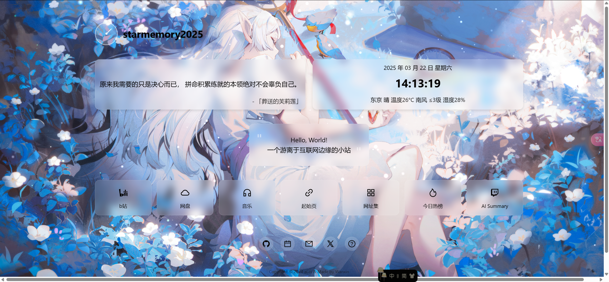

#

主要技术栈为react19+ant design+Typescript,Flask

一个简洁的个人主页，包括天气显示、网页导航，语录,Ai 翻唱等(前端服务器搭建在阿里云)

与AI Summary通信的后端为使用ngrok进行内网穿透的本地服务器。

## 配置

修改./my-homepage/src/constant/Constant.tsx中的BASEURL与MAPURL
```
export const BASEURL = ''//后端地址
export const MAPURL = ''//高德地图API
```

目前后端使用Flask与前端进行通信，主要功能包括歌曲获取+人声分离，以及Sovits4.1翻唱。

前端使用方式：

```bash
cd my-homepage
npm i
npm run build
```

然后运行build中的index.html即可。

后端：
Sovits4.1部署请参考：https://github.com/svc-develop-team/so-vits-svc.git

部署好后将web_flask_api_full_song_slice.py与开启接口服务.bat剪切到so-vits-svc文件夹中，双击开启接口服务.bat即可。

将webserver.py与requirement_web.txt放入同一个文件夹，
创建python环境并运行：
```bash
pip install -r requirement_web.txt
python webserver.py
```
